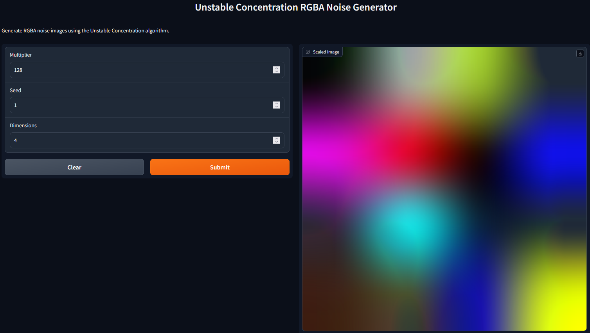

# Unstable Concentration
Process an image using the Unstable Concentration Feed Forward Seed Based Noise algorithm

**`UnstableConcentration`** is a cutting-edge project that harnesses the power of **`1-bit quantization`** using artificial intelligence (AI) to generate *`RGBA noise`*, offering a new generation of noise generation akin to `Perlin Noise`. This noise generation method is reproducible with a `seed`, allowing for **consistent** and **predictable** results.



## Features

- Utilizes a 1-bit feedforward neural network to generate RGBA noise.

- Reproducible noise generation with a seed parameter.

- Offers a modern alternative to traditional noise generation methods like Perlin Noise.
  
## Algorithm Overview
The Unstable Concentration algorithm operates as follows:

1.  **Input Tensor Generation**: A random input tensor xx of shape (512,)(512,) is created using PyTorch's `torch.randn()` function.
    
2.  **Neural Network Configuration**: An instance of the BitFeedForward class is created with the following parameters:
    
    -   `input_dim`: 512
    -   `hidden_dim`: 512
    -   `num_layers`: 4
3.  **Feedforward Propagation**: The BitFeedForward network processes the input tensor xx through four hidden layers, resulting in an output tensor yy.
    
4.  **Reshaping Output**: The output tensor yy is reshaped to dimensions (4,4,32)(4,4,32).
    
5.  **Image Conversion**: The tensor yy is converted to a PIL image using the `Image.fromarray()` function. The values are cast to `uint8` and interpreted as RGBA data.
    
6.  **Image Scaling**: The generated image is optionally scaled up by a multiplier factor specified by the user.
    
7.  **Image Saving**: The resulting image is saved as a PNG file.
    
## Mathematical Formulation
The Unstable Concentration algorithm can be represented mathematically as follows:

1.  **Neural Network Operation**:

```math
y=f(xW1)W2+by=f(xW1​)W2​+b
````

where:

-   yy is the output tensor.
-   xx is the input tensor.
-   W1W1​ and W2W2​ are weight matrices of the neural network.
-   bb is the bias term.
-   ff denotes the activation function used in each layer.

result:

2.  **Image Representation**:

The `RGBA image` II is represented as a `3D array` with dimensions (width,height,channels)(width,height,channels), where each channel (R, G, B, A) corresponds to a color component.

## Installation
To install UnstableConcentration, follow these steps:

1. Clone the repository:

bash
-  `git clone https://github.com/talkquazi/unstableconcentration.git`

- Navigate to the project directory:

bash

-  `cd UnstableConcentration`

- Install dependencies:

bash

 1.  `pip install -r requirements.txt`

## Usage
To generate Unstable Concentration noise, execute the provided Python script `unstableconcentration.py` with the following command-line arguments:

```bash
python unstableconcentration.py [outfilename] [seed] [multiplier]
```

-   `outfilename`: The name of the output file (optional, default is 'output').
-   `seed`: The seed value for random number generation (optional, default is -1 for random seed).
-   `multiplier`: The scaling factor for the image (optional, default is 1).

## Example

```bash
python unstableconcentration.py my_image 12345 2
```

This command generates Unstable Concentration noise with a seed of 12345 and scales the resulting image by a factor of 2.

## Gradio

```bash
python gradio.py
```

Then visit [localhost:7860](https://localhost:7860/)

## How It Works
UnstableConcentration employs a 1-bit feedforward neural network to generate RGBA noise. The network architecture consists of an input layer with 512 units, 4 hidden layers with 512 units each, and an output layer with 32 units.

The network takes a random input tensor as its input and applies a series of transformations to produce the output tensor, which represents RGBA noise. The output tensor is reshaped into a suitable format for image representation and converted to a PIL image.
  
## Acknowledgements
 [BitNet](https://github.com/kyegomez/BitNet) - For creating the 1bit inference interface.

 [ChatGPT](https://chat.openai.com) - For help writing up the algorithms.

 [Github Copilot](https://github.com/features/copilot) - For help with code documentation and formatting outputs.

 
## Contribution
Contributions to UnstableConcentration are welcome! If you'd like to contribute, please follow these guidelines:

1. Fork the repository.
2. Create a new branch.
3. Make your changes.
4. Test your changes thoroughly.
5. Create a pull request.

## License
`Unstable Concentration` is licensed under the MIT License. See `LICENSE` for more information.
